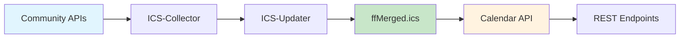

# Freifunk Calendar API

A modern, RESTful web service that provides calendar events from Freifunk communities in iCalendar (ICS) format. The API aggregates events from multiple community calendars and provides filtering, privacy protection, and timezone normalization.

## Features

- 🗓️ **Event Aggregation**: Combines events from multiple Freifunk community calendars
- 🔍 **Smart Filtering**: Filter by source, date range, and limit results
- 🔒 **Privacy Protection**: Automatically removes sensitive information (ATTENDEE, ORGANIZER)
- 🌍 **Timezone Handling**: Consistent timezone normalization and TZID support
- 🔄 **Recurring Events**: Automatic expansion of recurring events within date ranges
- ⚡ **Caching**: Built-in caching for improved performance
- ✅ **Validation**: Automatic ICS file validation and repair
- 🤖 **Automated Updates**: ICS-Updater system for continuous feed synchronization
- 🧪 **Well Tested**: Comprehensive test suite with 100+ assertions

## Quick Start

### Basic Usage

Get all events for the next 6 months:
```
GET https://api.freifunk.net/ics-collector/CalendarAPI.php?source=all
```

Get events from specific communities:
```
GET https://api.freifunk.net/ics-collector/CalendarAPI.php?source=berlin,hamburg
```

Get events for a specific date range:
```
GET https://api.freifunk.net/ics-collector/CalendarAPI.php?source=all&from=2024-01-01&to=2024-12-31
```

## API Documentation

For complete API documentation, see [docs/CalendarAPI.md](docs/CalendarAPI.md).

### Parameters

| Parameter | Required | Default | Description |
|-----------|----------|---------|-------------|
| `source` | ✅ | - | Community sources: `all` or comma-separated list |
| `format` | ❌ | `ics` | Output format (currently only `ics`) |
| `from` | ❌ | `now` | Start date (ISO date, relative date, or `now`) |
| `to` | ❌ | `+6 months` | End date (ISO date, relative date) |
| `limit` | ❌ | unlimited | Maximum number of events |

### Response Format

The API returns valid iCalendar (ICS) data with:
- Cleaned events (no ATTENDEE/ORGANIZER/VALARM)
- Proper timezone information
- Expanded recurring events
- Sorted by start date

## Installation

### Requirements

- PHP 8.1+
- Composer
- Sabre VObject library

### Setup

1. Clone the repository:
```bash
git clone https://github.com/freifunk/common.api.freifunk.net.git
cd common.api.freifunk.net/ics-collector
```

2. Install dependencies:
```bash
composer install
```

3. Set up the data directory:
```bash
mkdir -p data
# Place your merged ICS file at data/ffMerged.ics
```

4. Configure your web server to serve `CalendarAPI.php`

### Directory Structure

```
ics-collector/
├── CalendarAPI.php          # Main API endpoint
├── ics-collector.php        # Feed discovery endpoint
├── lib/
│   ├── CalendarConfig.php   # Central configuration
│   ├── SabreVObjectCalendarHandler.php
│   ├── IcsValidator.php
│   ├── ics-updater.php     # Automated feed updater
│   └── ics-merger.php      # ICS file merger
├── data/
│   ├── ffMerged.ics        # Merged calendar data
│   └── *.ics               # Individual community feeds
├── docs/
│   ├── CalendarAPI.md      # Complete API documentation
│   └── ICS-Updater.md      # ICS updater documentation
├── logs/
│   └── ics_updater.log     # Update logs
└── tests/                  # Test suite
```

## Configuration

The API uses centralized configuration through the `CalendarConfig` class:

### Default Settings

```php
// Default timezone
DEFAULT_TIMEZONE = 'Europe/Berlin'

// Default date range
DEFAULT_FROM_DATE = 'now'
DEFAULT_TO_DATE = '+6 months'

// Privacy protection
DEFAULT_EXCLUDED_PROPERTIES = ['ATTENDEE', 'ORGANIZER']
DEFAULT_EXCLUDED_COMPONENTS = ['VALARM']

// Caching
CACHE_LIFETIME = 3600 // 1 hour
```

### Customization

To customize settings, modify `lib/CalendarConfig.php` or extend the configuration class.

## Development

### Running Tests

```bash
# Run all tests
composer test

# Run specific test suites
vendor/bin/phpunit tests/php/CalendarConfigTest.php
vendor/bin/phpunit tests/php/SabreVObjectCalendarHandlerTest.php
vendor/bin/phpunit tests/php/CalendarAPIIntegrationTest.php
```

### Test Coverage

The project includes comprehensive tests covering:
- ✅ Configuration management
- ✅ Event parsing and processing
- ✅ Date range filtering
- ✅ Recurring event expansion
- ✅ Privacy protection (ATTENDEE/ORGANIZER/VALARM removal)
- ✅ Timezone handling
- ✅ API integration
- ✅ Error handling

### Code Quality

```bash
# Run PHP linting
find . -name "*.php" -exec php -l {} \;

# Run tests with coverage
vendor/bin/phpunit --coverage-html coverage/
```

## Adding Community Calendars

To add your Freifunk community calendar:

1. Ensure your community has an iCal feed URL
2. Add the feed to your community's JSON configuration:

```json
{
  "feeds": [
    {
      "name": "calendar",
      "url": "https://your-community.freifunk.net/events.ics",
      "category": "ics"
    }
  ]
}
```

3. The feed will be included in the next update cycle

## ICS-Updater System

The ICS-Updater automatically collects, validates, and merges calendar feeds from all Freifunk communities:

### System Architecture



### Automated Process
1. **Discovery**: Finds all community ICS feeds via the Community API
2. **Download**: Retrieves each feed and stores it locally
3. **Validation**: Checks feed validity and attempts automatic repair
4. **Merging**: Combines all valid feeds into `ffMerged.ics`
5. **Logging**: Records all activities and statistics

### Manual Update
```bash
# Run the updater manually
php lib/ics-updater.php

# Check update logs
tail -f logs/ics_updater.log
```

For detailed information, see [docs/ICS-Updater.md](docs/ICS-Updater.md).

## ICS Validation and Repair

The API includes automatic validation and repair features:

### Automatic Validation
- Validates ICS structure and required components
- Checks event validity (DTSTART, UID, etc.)
- Attempts automatic repair of common issues
- Logs validation results and statistics

### Manual Validation
```bash
# Validate a specific ICS file
php validate_all_ics.php --file=data/community.ics

# Validate all ICS files
php validate_all_ics.php --all

# Get help
php validate_all_ics.php --help
```

## Performance

### Caching Strategy
- Response caching based on request parameters
- 1-hour cache lifetime
- Cache headers indicate HIT/MISS status
- Automatic cache invalidation

### Optimization Tips
- Use specific source filters when possible
- Limit date ranges for better performance
- Implement client-side caching for frequently accessed data
- Use the `limit` parameter for pagination

## Security

### Privacy Protection
The API automatically removes sensitive information:
- **ATTENDEE**: Email addresses and attendee names
- **ORGANIZER**: Organizer contact information  
- **VALARM**: Personal reminder/alarm settings

### Input Validation
- All parameters are validated against allowed formats
- Date formats are strictly checked
- Source parameters are sanitized
- No SQL injection vectors (file-based data)

## Contributing

We welcome contributions! Please:

1. Fork the repository
2. Create a feature branch
3. Add tests for new functionality
4. Ensure all tests pass
5. Submit a pull request

### Development Guidelines
- Follow PSR-12 coding standards
- Add tests for new features
- Update documentation
- Use meaningful commit messages

## Support

- **Documentation**: [docs/CalendarAPI.md](docs/CalendarAPI.md)
- **Issues**: [GitHub Issues](https://github.com/freifunk/common.api.freifunk.net/issues)
- **Mailing List**: [wlannews@freifunk.net](mailto:wlannews@freifunk.net)
- **Chat**: [freifunk at matrix](https://matrix.to/#/#freifunk:matrix.org)

## License

This project is licensed under the MIT License - see the LICENSE file for details.

## Changelog

### Version 1.0.0
- ✨ Centralized configuration system
- ✨ Privacy protection (ATTENDEE/ORGANIZER/VALARM removal)
- ✨ Modern Sabre VObject implementation
- ✨ Comprehensive test suite
- ✨ Improved timezone handling
- ✨ Automatic ICS validation and repair
- ✨ Performance optimizations and caching
- 📚 Complete API documentation

### Previous Versions
- Legacy implementation with basic functionality
- JSON format support (deprecated)
- Basic event filtering
 
