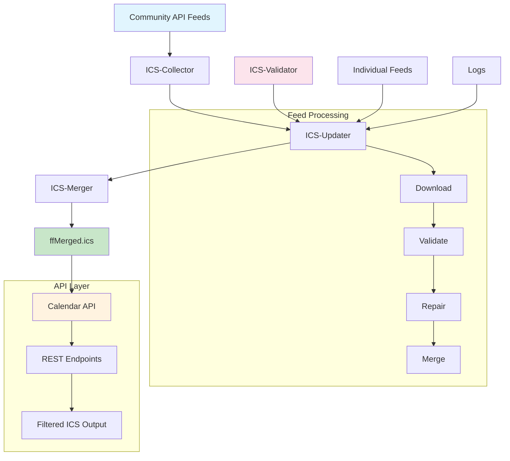
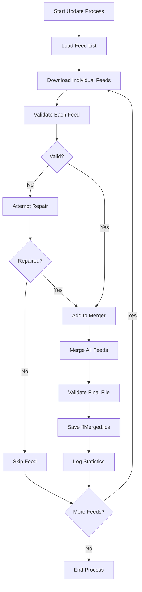
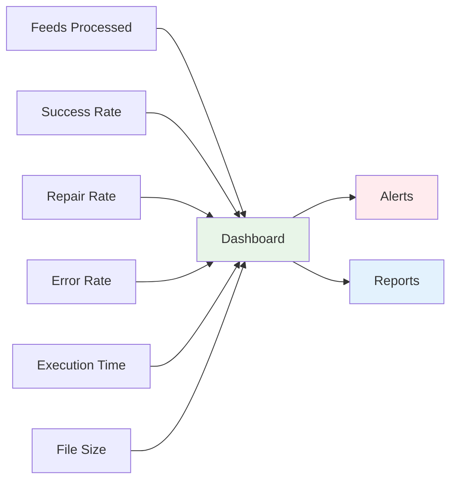

# ICS-Updater System Documentation

## Overview

The ICS-Updater system is an automated system that collects, validates, repairs, and merges calendar feeds from various Freifunk communities into a single ICS file. This merged file is then used by the Calendar API.

## System Architecture



## Components

### 1. ICS-Collector (`ics-collector.php`)

**Purpose**: Collects ICS feed URLs from the Community API and provides them as JSON.

**Functionality**:
- Loads the Community API from `https://api.freifunk.net/data/ffSummarizedDir.json`
- Extracts ICS feed URLs from community configurations
- Adds standard feeds (e.g., cross-community events)
- Returns a JSON list of all available ICS feeds

**Output Format**:
```json
{
  "berlin": {
    "url": "https://berlin.freifunk.net/calendar.ics",
    "lastchange": "2024-12-22",
    "city": "Berlin",
    "communityname": "Freifunk Berlin",
    "communityurl": "https://berlin.freifunk.net"
  },
  "gemeinsam": {
    "url": "https://ics.freifunk.net/tags/freifunk-common.ics",
    "lastchange": "2024-12-22",
    "city": "Everywhere",
    "communityname": "Freifunk.net - Cross-Community"
  }
}
```

**Usage**:
```bash
curl "https://api.freifunk.net/ics-collector/ics-collector.php"
```

### 2. ICS-Updater (`lib/ics-updater.php`)

**Purpose**: Main component that downloads, validates, and merges all ICS feeds.

**Workflow**:


**Execution**:
```bash
php lib/ics-updater.php
```

**Validation Statistics**:
```
ICS Validation Summary:
  Total:        15
  Valid:        12
  Repaired:     2
  Invalid:      1
  Skipped:      0
```

### 3. ICS-Merger (`lib/ics-merger.php`)

**Purpose**: Modern implementation for merging multiple ICS files using Sabre VObject.

**Features**:
- Uses Sabre VObject for robust ICS processing
- Adds custom properties (e.g., `X-WR-SOURCE`)
- Handles timezone information correctly
- Creates valid, RFC-compliant ICS output

**Usage**:
```php
$merger = new IcsMerger($headerConfig);
$merger->add($icsContent, ['X-WR-SOURCE' => 'berlin']);
$mergedIcs = $merger->getIcsString();
```

### 4. ICS-Validator (`lib/IcsValidator.php`)

**Purpose**: Validates and automatically repairs ICS files.

**Validation Checks**:
- Basic ICS structure (`BEGIN:VCALENDAR`, `END:VCALENDAR`)
- Required components (`VERSION`, `PRODID`)
- Event validity (`DTSTART`, `UID`, `DTSTAMP`)
- Timezone consistency

**Repair Functions**:
- Add missing headers
- Fix date/time formats
- Remove invalid characters
- Repair encoding issues

## Configuration

### API Configuration (`api-config.ini`)

```ini
[MERGED_ICS_HEADER]
PRODID = "-//FREIFUNK//Freifunk Calendar//EN"
X-WR-CALNAME = FFMergedIcs
X-WR-CALDESC = A combined ics feed of freifunk communities
X-WR-TIMEZONE = Europe/Berlin
VERSION = 2.0

[CUSTOM_PROPERTY_NAME]
SOURCE_PROPERTY = X-WR-SOURCE
SOURCE_URL_PROPERTY = X-WR-SOURCE-URL

[COMPONENT_URL]
ICS_COLLECTOR_URL = https://api.freifunk.net/ics-collector/ics-collector.php
SUMMARIZED_DIR_URL = https://api.freifunk.net/data/ffSummarizedDir.json
```

### Merger Configuration (`lib/ics-merger-config.ini`)

```ini
[ICS_HEADER]
PRODID = "-//Freifunk//Freifunk Calendar//EN"
X-WR-CALNAME = FFMergedIcs
X-WR-CALDESC = A combined ics feed of freifunk communities
X-WR-TIMEZONE = Europe/Berlin
VERSION = 2.0
```

## Automation

### Cron Job Setup

For automatic updates, set up a cron job:

```bash
# Daily at 6:00 AM
0 6 * * * cd /path/to/ics-collector && php lib/ics-updater.php >> logs/cron.log 2>&1

# Every 4 hours
0 */4 * * * cd /path/to/ics-collector && php lib/ics-updater.php >> logs/cron.log 2>&1
```

### Systemd Service (Alternative)

```ini
[Unit]
Description=Freifunk ICS Updater
After=network.target

[Service]
Type=oneshot
User=www-data
WorkingDirectory=/path/to/ics-collector
ExecStart=/usr/bin/php lib/ics-updater.php
StandardOutput=append:/var/log/freifunk-ics-updater.log
StandardError=append:/var/log/freifunk-ics-updater.log

[Install]
WantedBy=multi-user.target
```

With timer for regular execution:

```ini
[Unit]
Description=Run Freifunk ICS Updater every 4 hours
Requires=freifunk-ics-updater.service

[Timer]
OnCalendar=*-*-* 00,06,12,18:00:00
Persistent=true

[Install]
WantedBy=timers.target
```

## File System Layout

```
ics-collector/
├── ics-collector.php           # Feed discovery endpoint
├── lib/
│   ├── ics-updater.php        # Main update script
│   ├── ics-merger.php         # ICS merging
│   ├── ics-merger-config.ini  # Merger configuration
│   └── IcsValidator.php       # Validation and repair
├── data/
│   ├── ffMerged.ics          # Merged ICS file
│   ├── berlin.ics            # Individual community feeds
│   ├── hamburg.ics
│   └── ...
├── logs/
│   └── ics_updater.log       # Update log
└── api-config.ini            # Main configuration
```

## Logging and Monitoring

### Log Format

```
[2024-12-22 10:30:15] Retrieving ics from berlin..
[2024-12-22 10:30:16]   File is valid
[2024-12-22 10:30:17] Retrieving ics from hamburg..
[2024-12-22 10:30:18]   WARNING: Invalid ICS file for hamburg
[2024-12-22 10:30:18]   Attempting repair for hamburg
[2024-12-22 10:30:18]   Backup created: hamburg.ics.bak.20241222103018
[2024-12-22 10:30:18]   File repaired: hamburg.ics
[2024-12-22 10:30:18]   File successfully repaired
```

### Monitoring Metrics



- **Feeds Processed**: Total number of feeds found
- **Success Rate**: Percentage of successfully processed feeds
- **Repair Rate**: Number of automatically repaired feeds
- **Error Rate**: Number of unprocessable feeds
- **Execution Time**: Duration of entire update process
- **File Size**: Size of final `ffMerged.ics`

### Alerting

Monitor critical conditions:
- More than 20% of feeds failed
- Update process takes longer than 10 minutes
- Final ICS file is invalid
- No new events in the last 7 days

## Error Handling

### Common Issues

1. **Invalid ICS Feeds**
   - **Symptom**: Feed cannot be parsed
   - **Solution**: Automatic repair by IcsValidator
   - **Fallback**: Feed is skipped

2. **Network Timeouts**
   - **Symptom**: Feed download fails
   - **Solution**: Retry mechanism (3 attempts)
   - **Fallback**: Use last valid version

3. **Encoding Problems**
   - **Symptom**: Special characters display incorrectly
   - **Solution**: UTF-8 conversion in validator
   - **Fallback**: Remove problematic characters

4. **Timezone Conflicts**
   - **Symptom**: Events appear at wrong time
   - **Solution**: Normalize to Europe/Berlin
   - **Fallback**: UTC conversion

### Backup Strategy

```bash
# Create backup before each update
cp data/ffMerged.ics data/ffMerged.ics.backup.$(date +%Y%m%d_%H%M%S)

# Clean old backups (older than 30 days)
find data/ -name "*.backup.*" -mtime +30 -delete
```

## Performance Optimization

### Parallelization

```php
// Example for parallel feed processing
$feeds = array_chunk($allFeeds, 5); // 5 feeds in parallel
foreach ($feeds as $feedChunk) {
    $processes = [];
    foreach ($feedChunk as $feed) {
        $processes[] = new Process(['php', 'process-single-feed.php', $feed]);
    }
    // Execute in parallel...
}
```

### Caching

- **Feed Caching**: Only reload feeds when changed
- **Validation Cache**: Skip already validated feeds
- **Incremental Updates**: Only process changed feeds

### Memory Management

```php
// Memory limits for large feeds
ini_set('memory_limit', '512M');

// Garbage collection after each feed
gc_collect_cycles();
```

## API Integration

### Usage in Calendar API

```php
// CalendarAPI loads the merged file
$this->icsMergedFile = 'data/ffMerged.ics';

// Validation before use
$this->validateAndRepairIcsFile($this->icsMergedFile);
```

### Webhook Notifications

```php
// After successful update
function notifyWebhooks($stats) {
    $payload = [
        'timestamp' => date('c'),
        'status' => 'success',
        'stats' => $stats
    ];
    
    foreach ($webhookUrls as $url) {
        // POST request to webhook URL
        file_get_contents($url, false, stream_context_create([
            'http' => [
                'method' => 'POST',
                'content' => json_encode($payload),
                'header' => 'Content-Type: application/json'
            ]
        ]));
    }
}
```

## Development and Testing

### Local Development

```bash
# Test update with debug output
php lib/ics-updater.php --debug --dry-run

# Test single feed
php lib/test-single-feed.php --url="https://example.com/calendar.ics"

# Test validation
php validate_all_ics.php --file=data/test.ics --verbose
```

### Unit Tests

```bash
# ICS-Merger tests
vendor/bin/phpunit tests/php/IcsMergerTest.php

# Validator tests
vendor/bin/phpunit tests/php/IcsValidatorTest.php

# Integration tests
vendor/bin/phpunit tests/php/IcsUpdaterIntegrationTest.php
```

### Mock Feeds for Testing

```php
// Create test feed
$testFeed = <<<ICS
BEGIN:VCALENDAR
VERSION:2.0
PRODID:-//Test//Test//EN
BEGIN:VEVENT
UID:test@example.com
DTSTART:20241225T190000
DTEND:20241225T210000
SUMMARY:Test Event
END:VEVENT
END:VCALENDAR
ICS;
```

## Security

### Input Validation

- All URLs are checked for valid domains
- ICS content is sanitized before processing
- No execution of embedded code

### Access Control

- Update script only executable via CLI
- Web access to log files blocked
- Backup files outside web root

### Rate Limiting

```php
// Delay between feed downloads
usleep(500000); // 0.5 seconds

// Maximum feeds per update
$maxFeeds = 100;
```

## Troubleshooting

### Debug Mode

```bash
# Detailed output
php lib/ics-updater.php --verbose

# Validation only, no update
php lib/ics-updater.php --validate-only

# Debug single feed
php lib/debug-feed.php --source=berlin
```

### Common Commands

```bash
# Status of recent updates
tail -f logs/ics_updater.log

# Number of events in final file
grep -c "BEGIN:VEVENT" data/ffMerged.ics

# Feeds grouped by source
grep "X-WR-SOURCE:" data/ffMerged.ics | sort | uniq -c

# Validate final file
php validate_all_ics.php --file=data/ffMerged.ics
```

## Future Plans

### Planned Improvements

```mermaid
roadmap
    title ICS-Updater Roadmap
    section Q1 2025
        Webhook Support    : done, webhook, 2024-12-01, 2025-01-31
        GraphQL API       : active, graphql, 2025-01-01, 2025-02-28
    section Q2 2025
        Real-time Updates : realtime, 2025-02-01, 2025-04-30
        ML Categorization : ml, 2025-03-01, 2025-05-31
    section Q3 2025
        Multi-Language    : i18n, 2025-04-01, 2025-06-30
        Cloud Migration   : cloud, 2025-05-01, 2025-08-31
```

1. **Webhook Support**: Automatic notification on feed updates
2. **GraphQL API**: Modern API for feed management
3. **Real-time Updates**: WebSocket-based live updates
4. **Machine Learning**: Automatic event categorization
5. **Multi-Language**: Support for multilingual events

### Cloud Migration

- **AWS Lambda**: Serverless update functions
- **CloudWatch**: Monitoring and alerting
- **S3**: Backup and archiving
- **CloudFront**: CDN for better performance

## Support

- **Documentation**: [docs/CalendarAPI.md](CalendarAPI.md)
- **Issues**: [GitHub Issues](https://github.com/freifunk/common.api.freifunk.net/issues)
- **Mailing List**: [freifunk-dev@lists.freifunk.net](mailto:freifunk-dev@lists.freifunk.net)
- **IRC**: `#freifunk` on Libera.Chat 